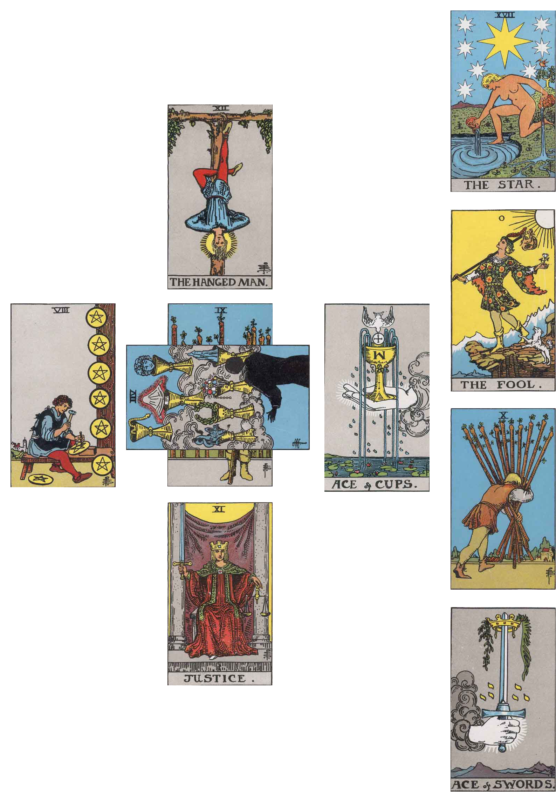

# tarot-tool

This tool will generate tarot spreads. Right now it will generate a linear collage of
cards given, à la [the three card spread,](https://www.daily-tarot-girl.com/tarot-card-spreads/3-card-tarot-spread-past-present-future/)
or (if passed the -c option) a [Celtic Cross](http://www.learntarot.com/ccross.htm)
spread.

## Usage

Run `./tarot-tool [cards...]`

~~~~~~
Usage of ./tarot-tool:
  -c	use a celtic cross layout
  -g int
    	pixels of spacing glue between edges (default 30)
~~~~~~

## Examples

### Three card spread

`./tarot-tool rws/wa09.jpg rws/cu07.jpg rws/ar11.jpg`

### Celtic Cross spread

`./tarot-tool -c rws/wa09.jpg rws/cu07.jpg rws/ar11.jpg rws/pe08.jpg rws/ar12.jpg rws/cuac.jpg rws/swac.jpg rws/wa10.jpg rws/ar00.jpg rws/ar17.jpg`

## Licensing

All code Copyright © 2017 chameleon, available under the MIT license.

All scans of tarot cards (in the rws/ directory) are in the public domain; as
outlined on my source for these images,
[The Internet Sacred Text Archive.](http://www.sacred-texts.com/tarot/index.htm)

Other images are similarly dedicated to the public domain (where possible)
under a Creative Commons
([CC0](https://creativecommons.org/publicdomain/zero/1.0/legalcode))
license. Copyright © 2017 chameleon.
